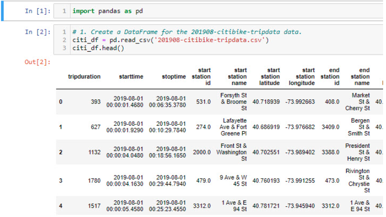
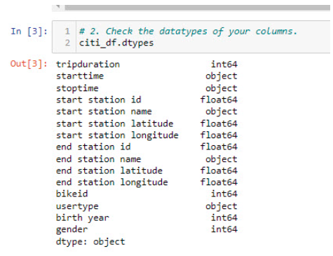
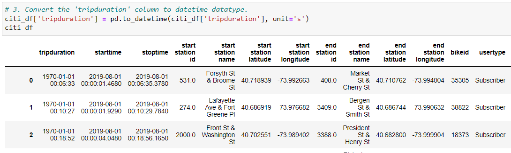
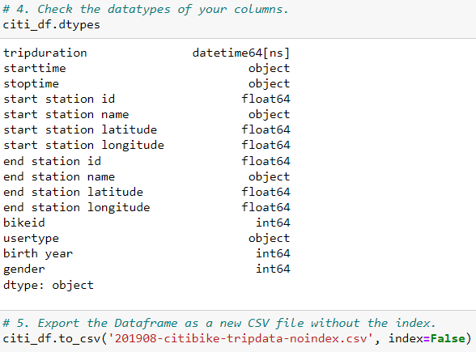
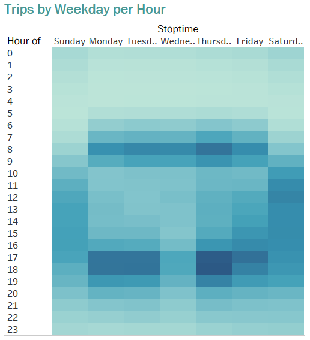
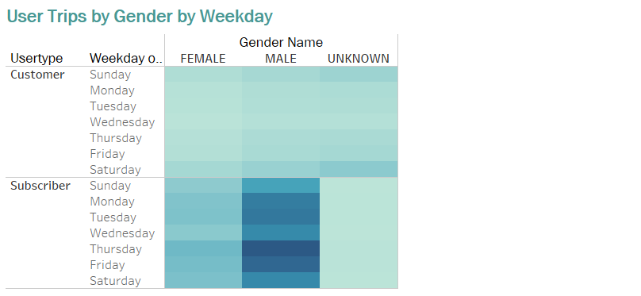
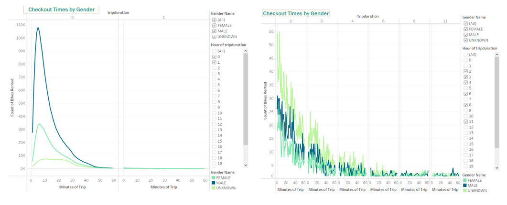
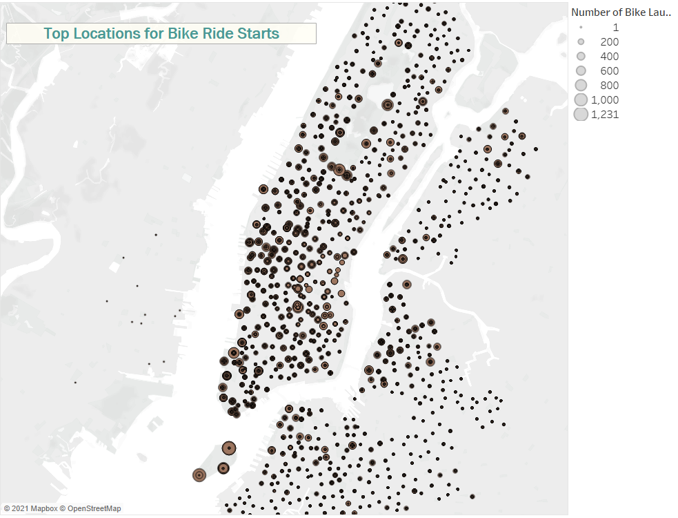
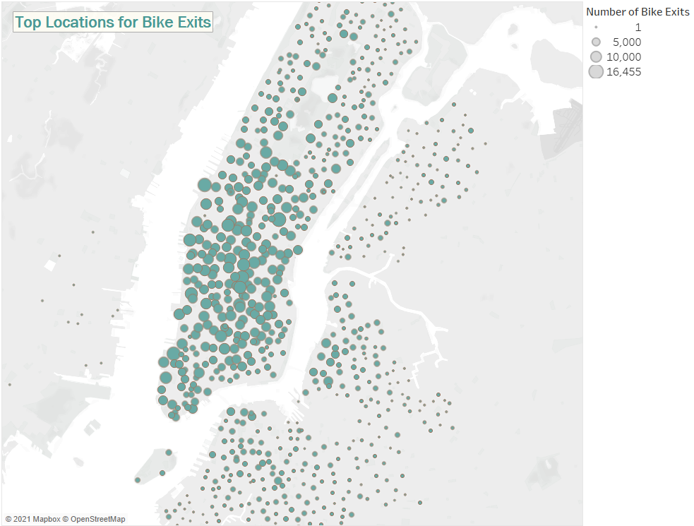

# 14Bikeshare

### Overview
Working with Cait to create and present a proposal to investors in Des Moines, IA an idea of creating a rideshare business modeled after Citibike in New York.

## Deliverable One
To prepare the data for use in Tableau, we needed to modify the .csv data format and we used Jupyter Notebook to do so.  Utilizing Python and Pandas to read the .csv file and then modify and export the file.
   

Once we had the dataframe, we needed to know what types of data were in the file:
   

We were then tasked with modifying the tripduration column from an integer to a datetime format using Python and Pandas.
  

Let's recheck the datatypes to see if it works and then export to a file with a new file name.
    

## Cait presents the following story image to help our potential investors understand our pitch:
   
The morning commute of bikeshare riders can see as many as 8000 - 30,000 users between the hours of 6-8am on weekdays! Talk about getting a move on!!

This image breaks down which group might be more likely to rent (customer or subscriber) and then the corresponding gender detail.

Checkout times by user, Cait explains, is a fascinating variable to dive into.  This graph shows very clearly, that most users rent a bike for short jaunts.  Less than one hour rentals are the top usage data point, it's very clear to see that for both men and women renters.  And there is SO much we could do with that data.  Should we charge more for the first 30 minutes?  Should it be on a sliding scale after that?  Very interesting data.

Even more incredible, Cait points out, to the investors is how malleable this data set is and how everything is not always as it seems.  Because SO MANY users rent for less than one hour, it appears to make the next hours flat line.  But if you remove that zero to sixty minutes-- WHOA!  A whole different set of data appears for their review.  You're able to see that men and women renters are more closely matched than we originally thought. How will that play into our marketing?

These symbol maps show that while there are distinct pods and centered activity where bike shares are most desireable there are also many stations spread far and wide on the map as well.  That's the unique characteristic of a bike, Cait explains, it really can take a user quite far geographically if they're driven (pardon the pun) to get themselves there.  The investors and Cait will need to consider the recovery costs for bikes that go missing.

## Link to Tableau Public: 
https://public.tableau.com/app/profile/elena.winter

Please view Mod14 Challenge by Elena Winter.

