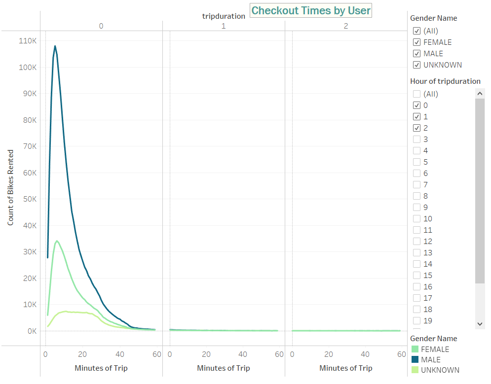

# 14Bikesharing

### Overview
Working with Cait create and present a proposal to investors in Des Moines, IA an idea of creating a rideshare business modeled after Citibike in New York.

## Deliverable One
To prepare the data for use in Tableau, we needed to modify the .csv data format and we used Jupyter Notebook to do so.  Utilizing Python and Pandas to read the .csv file and then modify and export the file.
   

Once we had the dataframe, we needed to know what types of data were in the file:
   

We were then tasked with modifying the tripduration column from an integer to a datetime format using Python and Pandas.
  

Let's recheck the datatypes to see if it works and then export to a file with a new file name.
    

## Tableau Storybook is as follows:
   

words and explanations

Many more words and explaining that I have to do

## Link to Tableau Public: 
https://public.tableau.com/app/profile/elena.winter

Please view Mod14 Challenge by Elena Winter.

